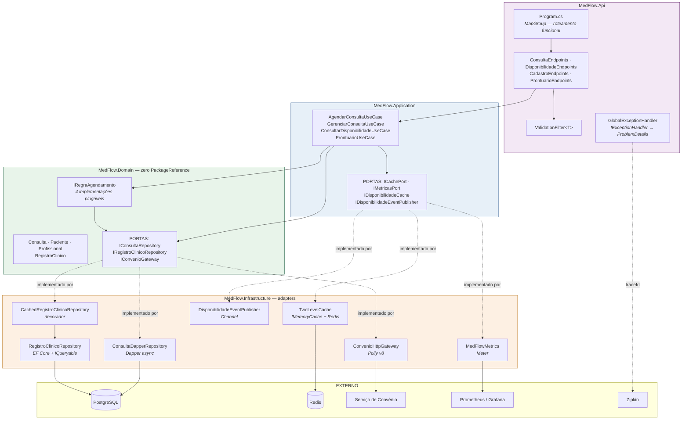

# MedFlow API — .NET 9 / C# 13

**Agendamento de Consultas e Prontuário Eletrônico**

Atividade Avaliativa — Programa de Pós-Graduação **UNIFUNEC**
_Arquiteturas Reativas, Microsserviços Resilientes, Observabilidade e SOLID_

> Reimplementação da API da Etapa 2 na plataforma .NET, preservando integralmente os requisitos arquiteturais da atividade e mapeando cada padrão dos Módulos 3, 4 e 5 para o seu equivalente idiomático em C#.

---

## 1. Por que o domínio de saúde

Cada requisito obrigatório da atividade tem aqui um caso de uso **real**, não um exemplo forçado.

| Requisito da atividade | Necessidade real do domínio |
|---|---|
| Não-bloqueio e push em tempo real | A agenda muda sozinha — um cancelamento libera uma vaga que outro paciente quer ver **agora**, sem recarregar a tela |
| Circuit Breaker + fallback gracioso | A verificação de cobertura de convênio é uma chamada a um sistema **de terceiros**, notoriamente instável. Se a operadora cair, a clínica não pode parar de agendar |
| Cache multinível | "Quais horários a Dra. Helena tem livres na segunda?" é lida centenas de vezes e muda poucas vezes por dia |
| Consultas dinâmicas tipadas | Buscar no prontuário combina filtros opcionais: paciente + período + profissional + diagnóstico |

---

## 2. Mapa de equivalências: Spring Boot → .NET 9

Esta é a tabela para abrir no vídeo ao lado do projeto Java. Cada linha é uma decisão deliberada, não uma tradução automática.

| Módulo | Spring Boot 3 | .NET 9 / C# 13 | Observação |
|---|---|---|---|
| 3 | Spring WebFlux + Netty | **ASP.NET Core + Kestrel** | Kestrel já é assíncrono e não-bloqueante por padrão |
| 3 | `RouterFunction` (roteamento funcional) | **Minimal APIs + `MapGroup`** | Equivalente direto: rotas declaradas como dados, sem controller |
| 3 | R2DBC (relacional reativo) | **Dapper `async`** | Mesmo objetivo: I/O não-bloqueante no caminho quente |
| 3 | `Flux` + `Sinks.Many` (SSE) | **`IAsyncEnumerable` + `Channel`** | Push em tempo real sem thread por cliente |
| 4 | Resilience4j `@CircuitBreaker`/`@Retry`/`@TimeLimiter`/`@Bulkhead` | **Polly v8 `ResiliencePipeline`** | Mesma pilha, mesma ordem, configuração equivalente |
| 4 | `ignore-exceptions` | **Predicado `ShouldHandle`** | Falha de negócio não conta para o circuito |
| 4 | `fallbackMethod` | **`catch` tipado após o pipeline** | Explícito e sem reflexão |
| 5 | Caffeine (L1) | **`IMemoryCache`** | |
| 5 | Redis (L2) | **StackExchange.Redis** | |
| 5 | `@Cacheable`/`@CachePut`/`@CacheEvict` | **Decorador `CachedRegistroClinicoRepository`** | Ver §4 — a diferença mais interessante |
| 5 | JPA `Specification` (Criteria API) | **Composição de `IQueryable`** | Muito mais curto, mesma segurança de tipos |
| 5 | JPA *Projection* | **`.Select(...)` do EF Core** | |
| 5 | Micrometer + `/actuator/prometheus` | **`System.Diagnostics.Metrics` + OpenTelemetry → `/metrics`** | |
| 5 | Zipkin (Micrometer Tracing) | **OpenTelemetry Zipkin exporter** | |
| 5 | Testcontainers (Java) | **Testcontainers for .NET** | Mesmos containers, mesma ideia |
| 5 | WireMock | **WireMock.Net** | |
| — | JUnit + Mockito | **xUnit + NSubstitute** | |
| — | `Clock` injetado | **`TimeProvider`** (BCL, .NET 8+) | |

### A diferença conceitual que vale explicar no vídeo

O Spring precisou do WebFlux porque o modelo Servlet é **bloqueante**: cada requisição prende uma thread. Todo o custo do `Mono`/`Flux` — encadeamento reativo, `subscribeOn`, `boundedElastic` — existe para contornar isso.

No .NET, `async`/`await` sobre Kestrel já é não-bloqueante desde o início: durante um I/O pendente nenhuma thread fica presa. O ganho arquitetural é o mesmo, **mas o código volta a ser linear e legível**. Compare o mesmo trecho:

```java
// Spring WebFlux
return carregarPaciente(request.pacienteId())
    .flatMap(paciente -> aplicarRegras(consulta)
        .then(verificarCobertura(paciente, request.procedimento()))
        .map(consulta::aplicarCobertura))
    .flatMap(consultaRepository::salvar)
    .flatMap(this::aposAgendar)
    .map(ConsultaResponse::de);
```

```csharp
// .NET
var paciente = await pacienteRepository.BuscarPorIdAsync(request.PacienteId, ct)
    ?? throw new RecursoNaoEncontradoException("Paciente", request.PacienteId);

await AplicarRegrasAsync(consulta, ct);
consulta.AplicarCobertura(await VerificarCoberturaAsync(paciente, request.Procedimento, ct));

var salva = await consultaRepository.SalvarAsync(consulta, ct);
await AposAgendarAsync(salva, ct);
return ConsultaResponse.De(salva);
```

Consequência prática visível no código: o `ProntuarioUseCase` da versão Java precisava empurrar toda chamada JPA para `Schedulers.boundedElastic()` para não travar a event loop. Aqui **esse problema não existe** — o EF Core é assíncrono de ponta a ponta.

---

## 3. Arquitetura



### A regra de dependência é verificada pelo compilador

Esta é a vantagem mais concreta da solução multi-projeto sobre a organização em pacotes da versão Java.

```xml
<!-- src/MedFlow.Domain/MedFlow.Domain.csproj -->
<Project Sdk="Microsoft.NET.Sdk">
  <!-- Nenhuma PackageReference. Nenhum ProjectReference. -->
</Project>
```

Na versão Spring, "o domínio não deve depender da infraestrutura" era uma **convenção** — nada impedia alguém de escrever `import org.springframework.data...` numa classe de domínio. Aqui, `MedFlow.Domain` não referencia EF Core, Dapper, Polly nem ASP.NET Core: uma violação **não compila**. A regra deixou de ser disciplina e virou garantia.

---

## 4. Como os princípios SOLID guiaram o desacoplamento

Roteiro do item 3 do vídeo.

### SRP — Single Responsibility

`AgendarConsultaUseCase` **orquestra** e nada mais: não valida (delega a `IRegraAgendamento`), não fala HTTP (delega a `IConvenioGateway`), não sabe SQL (delega às portas), não conhece OpenTelemetry (delega a `IMetricasPort`) e não trata exceção (`GlobalExceptionHandler`).

A `Consulta` é dona das próprias transições — quem decide se um cancelamento é válido é a entidade (`consulta.Cancelar()`), não o use case.

### OCP — Open/Closed

```csharp
public sealed class AgendarConsultaUseCase(..., IEnumerable<IRegraAgendamento> regras, ...)
{
    private readonly IReadOnlyList<IRegraAgendamento> _regras = [.. regras.OrderBy(r => r.Ordem)];
}
```

Para adicionar *"paciente não pode ter duas consultas no mesmo dia"*: cria-se a classe e acrescenta-se **uma linha** em `DependencyInjection`. O use case não muda. O teste `RegraNovaEntraPorInjecao` prova isso injetando uma regra que só existe dentro do teste.

### LSP — Liskov

`CachedRegistroClinicoRepository` e `RegistroClinicoRepository` implementam a mesma porta e são intercambiáveis — nenhum use case percebe qual está em uso.

### ISP — Interface Segregation

`IConvenioGateway` tem **um** método. E `IDisponibilidadeCache` existe justamente por ISP: quem agenda ou cancela precisa apenas *invalidar* a agenda, não consultá-la. Sem essa porta, `AgendarConsultaUseCase` dependeria da classe concreta `ConsultarDisponibilidadeUseCase` inteira.

### DIP — Dependency Inversion

Todos os colaboradores injetados são interfaces ou tipos do domínio. O caso mais didático é `IMetricasPort`: o use case diz *"uma consulta foi criada"*, não *"incremente o contador OpenTelemetry"*.

E `ParametrosAgenda` é um **record do domínio** — a infraestrutura apenas o alimenta a partir do `appsettings.json`. As regras de negócio não conhecem `IOptions<T>`.

---

## 5. Requisitos obrigatórios — onde cada um está no código

| Dimensão | Requisito | Implementação |
|---|---|---|
| **Design & SOLID** | Separação estrita de camadas, SRP e DIP com abstrações | Quatro projetos com dependências verificadas em tempo de compilação; portas em `Domain/Repositories`, `Domain/Gateways`, `Application/Ports` |
| **Reatividade / Dados** | Roteamento funcional **ou** persistência otimizada com consultas dinâmicas | **Os dois:** Minimal APIs + Dapper no agendamento; composição de `IQueryable` + projeção no prontuário |
| **Resiliência** | Circuit Breaker e fallback gracioso | `ConvenioHttpGateway`: Retry → CircuitBreaker → Timeout → ConcurrencyLimiter, com tratamento distinto para falha de negócio e falha técnica |
| **Performance & Observabilidade** | Cache multinível + métricas | `TwoLevelCache` (`IMemoryCache` + Redis) e `MedFlowMetrics` (`Meter` → Prometheus) |

### Três detalhes técnicos que valem menção no vídeo

**1. Decorador em vez de `@Cacheable`.** O .NET não tem cache por anotação, e isso acabou virando vantagem. `CachedRegistroClinicoRepository` embrulha o repositório real: é explícito (dá para ler o que é cacheado e quando é invalidado), não depende de proxy dinâmico — então **funciona em chamadas internas**, evitando a armadilha clássica de self-invocation do Spring AOP — e é testável sem subir container de DI.

**2. Falha de negócio ≠ falha técnica.** O convênio negar cobertura (HTTP 4xx) é resposta esperada; ele estar fora do ar (5xx/timeout) é falha. `CoberturaNegadaException` não aparece em nenhum `ShouldHandle` do pipeline Polly, então atravessa retry e circuit breaker sem ser contabilizada — exatamente a semântica do `ignore-exceptions` do Resilience4j, só que explícita.

**3. Cache tipado, sem envelope.** Na versão Java foi preciso um envelope carregando o nome do tipo, porque a interface `org.springframework.cache.Cache` é destipada e o serializador padrão não grava o tipo de `record`s. Aqui a porta é genérica (`ObterAsync<T>`), o tipo é conhecido em tempo de compilação e o Redis guarda **JSON puro** — legível no `redis-cli`, sem metadados. Menos código e melhor observabilidade.

---

## 6. Como executar

### Opção A — stack completa (recomendada para o vídeo)

```bash
docker compose up -d --build
```

> **Conflito de nomes e portas.** Os serviços usam `container_name` fixo
> (`medflow-postgres`, `medflow-redis`, `medflow-prometheus`, `medflow-grafana`,
> `medflow-zipkin`, `medflow-convenio-mock`) e as portas padrão. Se a versão Spring Boot
> desta mesma API estiver no ar, os nomes colidem e o `up` falha. Derrube a outra stack
> antes:
>
> ```bash
> docker compose -p medflow-api down     # a partir do diretório da versão Spring Boot
> ```
>
> Para rodar as duas lado a lado, sobrescreva o prefixo e as portas via variáveis de
> ambiente (veja os defaults em `docker-compose.yml`):
>
> ```bash
> MEDFLOW_PREFIX=medflow-net MEDFLOW_PORTA_API=8090 MEDFLOW_PORTA_PG=5433 \
>   MEDFLOW_PORTA_REDIS=6380 MEDFLOW_PORTA_GRAFANA=3001 \
>   MEDFLOW_PORTA_PROMETHEUS=9091 MEDFLOW_PORTA_ZIPKIN=9412 \
>   MEDFLOW_PORTA_WIREMOCK=8091 docker compose up -d --build
> ```

| Serviço | URL | Credenciais |
|---|---|---|
| API | http://localhost:8080 | — |
| **Scalar (OpenAPI)** | http://localhost:8080/scalar/v1 | — |
| Métricas (Prometheus) | http://localhost:8080/metrics | — |
| Health | http://localhost:8080/health | — |
| Estado do circuito | http://localhost:8080/health/circuit | — |
| Prometheus | http://localhost:9090 | — |
| **Grafana** | http://localhost:3000 | `admin` / `admin` |
| Zipkin | http://localhost:9411 | — |
| Convênio (WireMock) | http://localhost:8089 | — |

O dashboard **"MedFlow .NET — Negócio, Cache e Resiliência"** já vem provisionado no Grafana (pasta *MedFlow*), com o datasource configurado. Nada de importar nada na mão durante a gravação.

### Opção B — sem Docker (SQLite)

```bash
dotnet run --project src/MedFlow.Api
```

Sobe com SQLite em arquivo e sem Redis. O cache degrada para L1 e a aplicação funciona normalmente — é a degradação graciosa em ação.

### Configuração

Tudo em `appsettings.json`, seção `MedFlow`. O `appsettings.Docker.json` sobrescreve para PostgreSQL + Redis + Zipkin + WireMock.

| Chave | Padrão | Descrição |
|---|---|---|
| `MedFlow:Banco:Provider` | `sqlite` | `sqlite` ou `postgres` |
| `MedFlow:Banco:ConnectionString` | `Data Source=medflow.db` | |
| `ConnectionStrings:Redis` | `localhost:6379` | Vazio = só L1 |
| `MedFlow:Convenio:BaseUrl` | `http://localhost:8089` | Serviço externo |
| `MedFlow:Cache:L1TtlSegundos` / `L2TtlSegundos` | `30` / `300` | |
| `OpenTelemetry:ZipkinEndpoint` | `http://localhost:9411/...` | Vazio = sem tracing |

---

## 7. Endpoints

### Agendamento — Minimal APIs

| Método | Rota | Descrição |
|---|---|---|
| `POST` | `/api/pacientes` | Cadastra paciente |
| `GET` | `/api/pacientes/{id}` · `/api/pacientes` | Busca / lista |
| `POST` | `/api/profissionais` · `GET /api/profissionais` | Cadastra / lista |
| `GET` | `/api/profissionais/{id}/disponibilidade?data=AAAA-MM-DD` | Horários livres **(cache L1+L2)** |
| `GET` | `/api/profissionais/{id}/disponibilidade/stream` | **SSE** — push de vagas em tempo real |
| `POST` | `/api/consultas` | Agenda **(dispara o Circuit Breaker do convênio)** |
| `GET` | `/api/consultas/{id}` | Busca consulta |
| `PATCH` | `/api/consultas/{id}/cancelar` | Cancela, invalida o cache e emite evento SSE |
| `PATCH` | `/api/consultas/{id}/confirmar` | Confirma presença |
| `GET` | `/api/pacientes/{pacienteId}/consultas` | Consultas do paciente |

### Prontuário — EF Core

| Método | Rota | Descrição |
|---|---|---|
| `POST` | `/api/registros-clinicos` | Registra atendimento |
| `GET` | `/api/registros-clinicos/buscar?pacienteId=&profissionalId=&periodoInicio=&periodoFim=&diagnostico=` | Busca dinâmica |
| `GET` | `/api/registros-clinicos/paciente/{id}/resumo` | Resumo **(projeção + cache)** |

### Observabilidade

`/health` · `/health/circuit` · `/metrics` · `/scalar/v1`

---

## 8. Exemplos de requisição

```bash
# Cadastra um paciente COM convênio (passa pela verificação externa)
curl -X POST http://localhost:8080/api/pacientes \
  -H 'Content-Type: application/json' \
  -d '{"nome":"Carlos Belchior","cpf":"123.456.789-00",
       "dataNascimento":"1990-05-14","email":"carlos@exemplo.com",
       "telefone":"17999990000","convenioId":1}'

# Disponibilidade (1ª vez MISS, 2ª vez HIT em L1)
curl "http://localhost:8080/api/profissionais/1/disponibilidade?data=2026-08-17"

# Agenda
curl -X POST http://localhost:8080/api/consultas \
  -H 'Content-Type: application/json' \
  -d '{"pacienteId":1,"profissionalId":1,
       "dataHora":"2026-08-17T09:00:00","procedimento":"CONSULTA_CARDIOLOGIA"}'

# Procedimento estético -> WireMock devolve 422 -> NaoCoberto, circuito segue Closed
curl -X POST http://localhost:8080/api/consultas \
  -H 'Content-Type: application/json' \
  -d '{"pacienteId":1,"profissionalId":1,
       "dataHora":"2026-08-17T10:00:00","procedimento":"PROCEDIMENTO_ESTETICO"}'

# Busca dinâmica no prontuário (todos os filtros são opcionais)
curl "http://localhost:8080/api/registros-clinicos/buscar?pacienteId=1&diagnostico=faringite"

# Push em tempo real (deixe aberto e cancele uma consulta em outro terminal)
curl -N -H "Accept: text/event-stream" \
  http://localhost:8080/api/profissionais/1/disponibilidade/stream
```

---

## 9. Como forçar o Circuit Breaker na demonstração

**1. Script pronto (recomendado)**

```bash
./scripts/demo-circuit-breaker.sh
```

Mostra o estado inicial do circuito, derruba o WireMock, dispara 15 agendamentos, imprime o estado a cada chamada e exibe as métricas que provam o fallback. **Todas as requisições continuam devolvendo `201 Created`** — as consultas nascem com status `AguardandoValidacaoConvenio`.

**2. Manual**

```bash
docker compose stop wiremock
# dispare vários POST /api/consultas
curl -s http://localhost:8080/health/circuit
docker compose start wiremock   # após ~10s volta a HalfOpen e depois Closed
```

**3. Sem derrubar nada** — procedimento que dispara o `Timeout` do pipeline:

```bash
curl -X POST http://localhost:8080/api/consultas \
  -H 'Content-Type: application/json' \
  -d '{"pacienteId":1,"profissionalId":1,
       "dataHora":"2026-08-17T11:00:00","procedimento":"EXAME_LENTO"}'
```

O stub `cobertura-lenta.json` atrasa 6s; o `AddTimeout` corta em 2s e o fallback assume.

Outros scripts: `./scripts/demo-cache.sh` e `./scripts/demo-sse.sh`.

---

## 10. Testes

```bash
./scripts/verificar.sh          # restore + build + testes
# ou
dotnet test
```

| Projeto / Classe | O que prova | Precisa de Docker? |
|---|---|---|
| `AgendarConsultaUseCaseTests` | Regras, degradação graciosa, paciente particular, **OCP com regra criada dentro do teste** | Não |
| `TwoLevelCacheTests` | L1 hit, promoção L2→L1 tipada, invalidação nas duas camadas, **Redis com falha não propaga erro**, funcionamento sem Redis | Não |
| `ConvenioResilienciaTests` | WireMock.Net: fallback em 500, **circuito abre** sob falhas repetidas, **422 não abre o circuito** | Não |
| `MedFlowApiTests` | Percurso ponta a ponta com **PostgreSQL e Redis reais** + degradação graciosa + ProblemDetails | **Sim** |

Os testes unitários rodam em qualquer máquina. Os de integração usam Testcontainers e exigem Docker — para a gravação, rode com o Docker ligado para exibir a suíte completa em verde.

---

## 11. Decisões de projeto e trade-offs

Registrados por honestidade técnica — são bons pontos de discussão na banca.

**Dapper e EF Core na mesma aplicação.** Não é indecisão: o agendamento tem consultas de forma fixa e altíssima frequência, onde o overhead de change tracking do EF Core não se paga; o prontuário precisa de filtros combináveis, onde montar SQL na mão seria pior. É a mesma justificativa que levou a R2DBC + JPA na versão Java, com a diferença de que aqui **as duas opções são assíncronas**.

**Linhas de persistência explícitas (`ConsultaRow`).** Na versão Java, as entidades de domínio carregavam anotações de mapeamento e a conversão de enums dependia do comportamento implícito do driver — que difere entre H2 e PostgreSQL. Aqui o domínio é 100% limpo e a tradução vive em records visíveis e testáveis. O enum vira string em um lugar só. Custa algumas linhas a mais e elimina uma classe inteira de surpresas.

**DDL manual em vez de migrations do EF Core.** Como a maior parte da persistência é Dapper, ter migrations cobrindo só uma tabela criaria duas fontes de verdade para o schema. `SchemaScripts` mantém o DDL explícito num lugar só. Em um projeto de produção de vida longa, migrations seriam a escolha certa.

**Cache resiliente por decisão.** Redis fora do ar degrada para L1 em vez de propagar erro — e `AbortOnConnectFail = false` garante que a aplicação **suba** mesmo sem Redis. Um cache indisponível deve deixar o sistema mais lento, nunca quebrado.

**`HybridCache` não foi usado.** O .NET 9 traz `Microsoft.Extensions.Caching.Hybrid`, que já faz L1+L2 com proteção contra stampede. Preferimos o `TwoLevelCache` explícito por dois motivos: ele expõe **qual camada** serviu cada hit (métrica `medflow_cache_hit{camada}`, que é justamente o que se quer mostrar no vídeo) e torna as mecânicas do padrão visíveis para a avaliação. Em produção, `HybridCache` seria a escolha padrão.

---

## 12. Estrutura da solução

```
MedFlow.sln
├── src/
│   ├── MedFlow.Domain/              # ZERO dependências — regra verificada pelo compilador
│   │   ├── Model/                   # Consulta, Paciente, Profissional, RegistroClinico
│   │   ├── Repositories/            # PORTAS de persistência (DIP)
│   │   ├── Gateways/                # PORTA do serviço externo (DIP)
│   │   ├── Rules/                   # IRegraAgendamento + 4 implementações (OCP)
│   │   └── Exceptions/
│   ├── MedFlow.Application/         # só abstrações: DI, logging, validação
│   │   ├── UseCases/ · Dtos/ · Ports/
│   ├── MedFlow.Infrastructure/      # adapters — implementam as portas
│   │   ├── Persistence/Dapper/      # agendamento + linhas de persistência + DDL
│   │   ├── Persistence/EfCore/      # prontuário + specifications + decorador de cache
│   │   ├── Gateway/                 # ConvenioHttpGateway (Polly v8)
│   │   ├── Cache/ · Metrics/ · Events/ · Configuration/
│   └── MedFlow.Api/                 # host
│       ├── Program.cs · Endpoints/ · Filters/ · GlobalExceptionHandler.cs
└── tests/
    ├── MedFlow.UnitTests/           # xUnit + NSubstitute + WireMock.Net
    └── MedFlow.IntegrationTests/    # Testcontainers + WebApplicationFactory
```

### Recursos de C# 13 / .NET 9 utilizados

| Recurso | Onde | Ganho |
|---|---|---|
| Primary constructors | Praticamente todos os serviços | Elimina o boilerplate de campo + construtor |
| Collection expressions `[..]` | `AgendarConsultaUseCase`, mapeamentos | `[.. regras.OrderBy(r => r.Ordem)]` |
| `System.Threading.Lock` (C# 13) | `DisponibilidadeEventPublisher` | Trava mais rápida e à prova de uso incorreto |
| `required` / `init` | Entidades de domínio | Invariantes garantidas na construção |
| Raw string literals | SQL e DDL | SQL legível sem escapes |
| `TimeProvider` | Regras de agendamento | Tempo injetável e testável |
| Nullable reference types + warnings as errors | Solução inteira | Ausência de valor é parte do tipo |
| `IExceptionHandler` | Tratamento global | ProblemDetails (RFC 7807) |

---

## 13. Integrantes do grupo

| Nome completo |
|---|
| _(preencher antes da entrega — máximo 5)_ |
| |
| |
| |
| |

---

## 14. Checklist de entrega

- [ ] Demonstrar os 3 modelos-base (Módulos 3, 4 e 5) rodando
- [ ] Vídeo gravado com narração, seguindo o roteiro da Etapa 3
- [ ] Código-fonte + este README no Google Drive (permissão de leitura liberada)
- [ ] E-mail para **estremot@gmail.com** com assunto `[PÓS UNIFUNEC] Atividade Avaliativa - Nome do Grupo / Integrantes`
- [ ] Corpo do e-mail com o nome completo de todos os integrantes e o link do Drive
